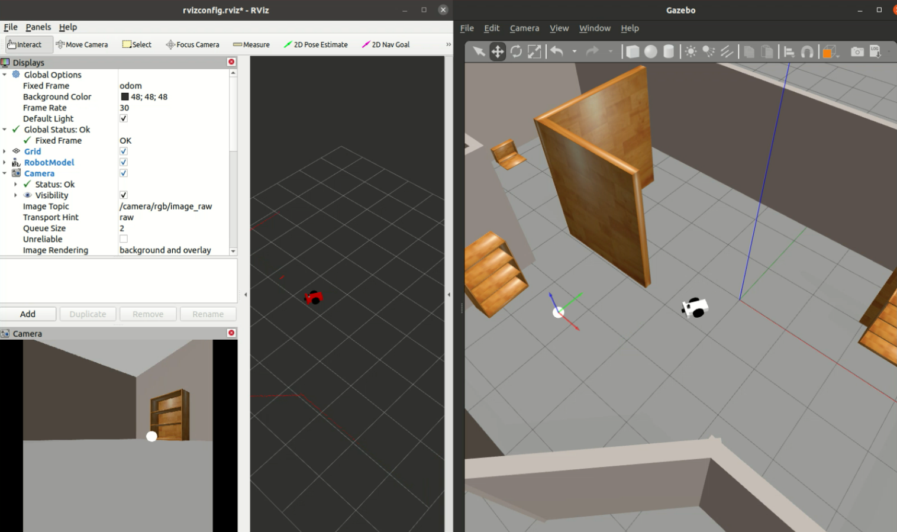

# Go-Chase-It!
This project involves designing a differential drive mobile robot which is able to detect and chase white-colored balls inside a custom Gazebo world.

<br>


The mobile robot is designed with the Unified Robot Description Format (URDF) and employs two sensors: 
* Hokuyo Lidar 
* Camera

Gazebo plugins are utilized for the differential drive and the sensors. 
Two nodes are implemented to detect a white ball and to drive the robot around in order to chase the ball.

## Key Concepts
Concepts explored in this project:
* Gazebo models and building worlds
* Gazebo plugins
* URDF
* Launch files
* ROS Publishers, Subscribers and Services
* C++

## Structure
There are two packages in this project.
* **my_robot**: This package holds the robot, the white ball and the Gazebo world.

* **ball_chaser**: The ball_chaser package has two nodes: the *drive_bot* and *process_image*.
  * *drive_bot*: This server node provides a service to drive the robot by controlling its linear x and angular z velocities. This service publishes a message containing the requested robot velocities. 
  * *process_image*: This client node subscribes to the robot's camera images and analyzes each image to determine the presence and position of a white ball. If a white ball exists in the image, the node will request a service via a client to drive the robot towards it.

The directory structure is depicted below:
```
.RoboND-Go-Chase-It                # Go Chase It Project
├── my_robot                       # my_robot package
│   ├── launch                     # launch folder for launch files
│   │   ├── robot_description.launch
│   │   ├── world.launch
│   │   ├── rvizconfig.rviz
│   ├── meshes                     # meshes folder for sensors
│   │   ├── hokuyo.dae
│   ├── urdf                       # urdf folder for xarco files
│   │   ├── my_robot.gazebo
│   │   ├── my_robot.xacro
│   ├── worlds                     # worlds folder for world files
│   │   ├── myworld.world
│   ├── CMakeLists.txt             # compiler instructions
│   ├── package.xml                # package info
├── ball_chaser                    # ball_chaser package
│   ├── launch                     # launch folder for launch files
│   │   ├── ball_chaser.launch
│   ├── src                        # source folder for C++ scripts
│   │   ├── drive_bot.cpp
│   │   ├── process_images.cpp
│   ├── srv                        # service folder for ROS services
│   │   ├── DriveToTarget.srv
│   ├── CMakeLists.txt             # compiler instructions
│   ├── package.xml                # package info
├── images                         # simulation gif
```

## Technologies
Project is created with:
* ROS Noetic
* Gazebo 11.5.1

## Installation
To run this project, you must have ROS and Gazebo installed.

#### Create a catkin_ws, if you do not already have one.
```sh
$ mkdir -p /catkin_ws/src/
$ cd catkin_ws/src/
$ catkin_init_workspace
```

#### Clone the project in catkin_ws/src/.
```sh
$ git clone https://github.com/elena-ecn/RoboticsND-Go-Chase-It.git
```

#### Build the packages.
```sh
$ cd /catkin_ws/
$ catkin_make
```

#### Source your environment.
```sh
$ source devel/setup.bash
```

#### Launch the simulation environment.
```sh
$ roslaunch my_robot world.launch
```

#### Launch the ball chaser.
In a new terminal (Ctrl+Shift+T), type:
```sh
$ source devel/setup.bash
$ roslaunch ball_chaser ball_chaser.launch
```

#### Play around! 
Pick up the white ball and place in front of the robot. The robot will start chasing the ball!

<br>



## License
The contents of this repository are covered under the [MIT License](LICENSE).
